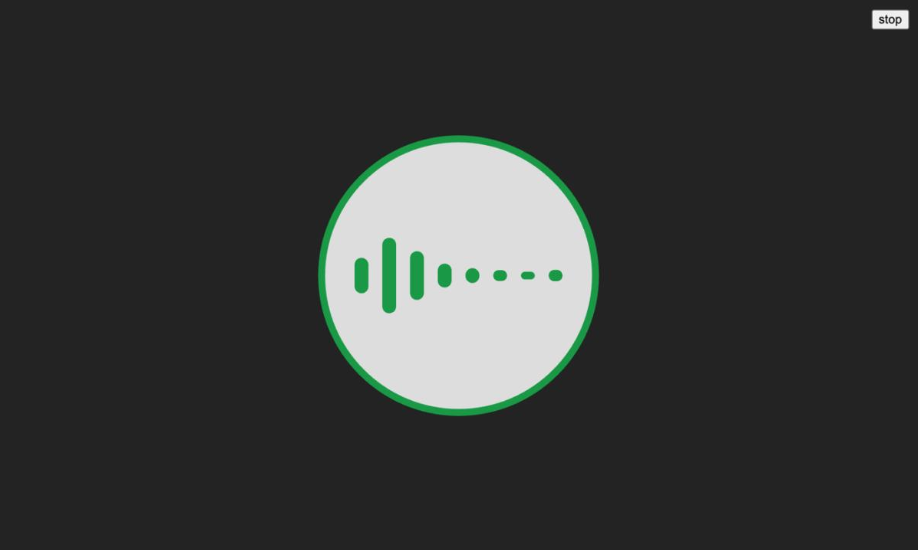

# Audio Visualisation

## Audio Features

This application visualises different features of the audio using p5.js and Meyda:

**Amplitude spectrum**

Amplitude spectrum returns an array of frequencies along with their corresponding amplitudes. The array was narrowed down into 8 frequencies within the audio’s frequency range, and their amplitudes were displayed using the heights of the bars.

**ZCR**

ZCR identifies the percussive sounds from the pitched sounds. The ZCR was mapped to the size of the circles, with the outer circle being more sensitive than the inner circle for greater visual impact.

**Spectral centroid**

Spectral centroid represents the brightness of a sound. To visualise the brightness of the audio, the spectral centroid was mapped from black to white using lerpColor, so that the brighter parts of the audio look like they are flashing.

## Speech Recognition

Voice commands were implemented using p5.speech to change the colour of the bars and outer circle. The following voice commands are accepted: red, orange, yellow, green, blue, purple.
